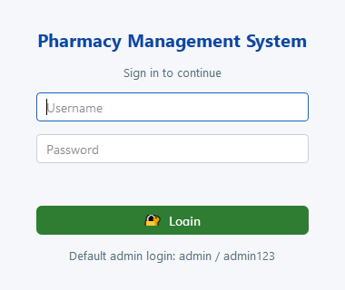
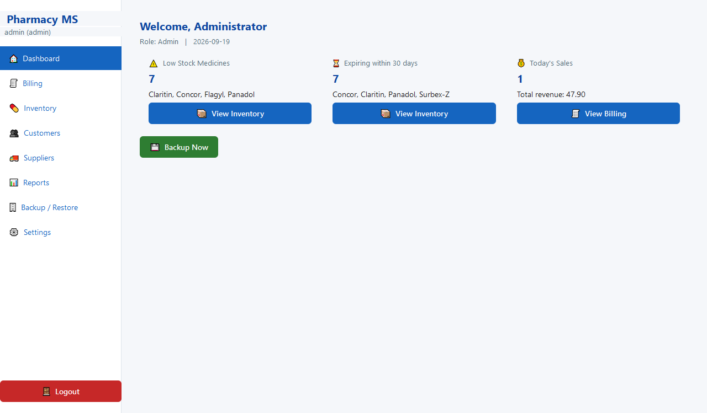
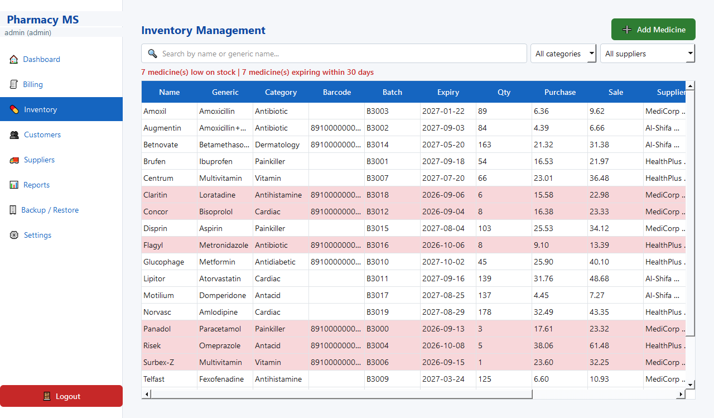
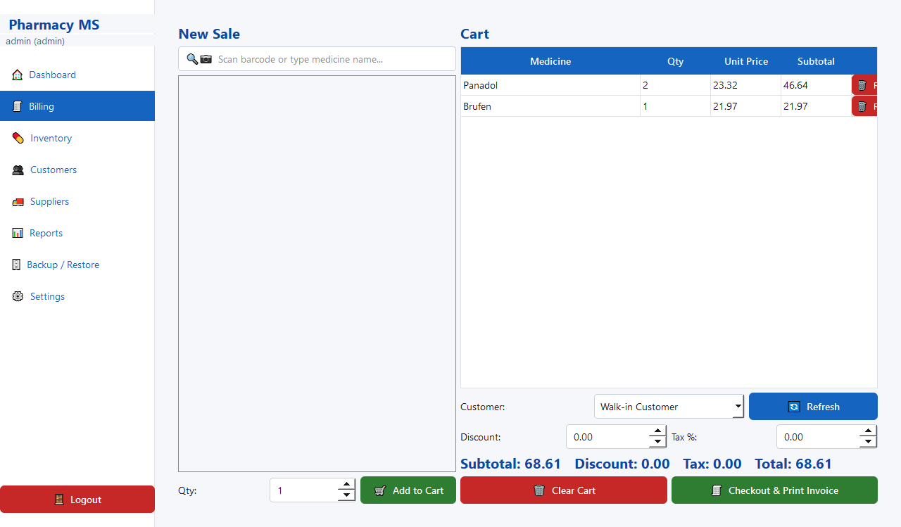
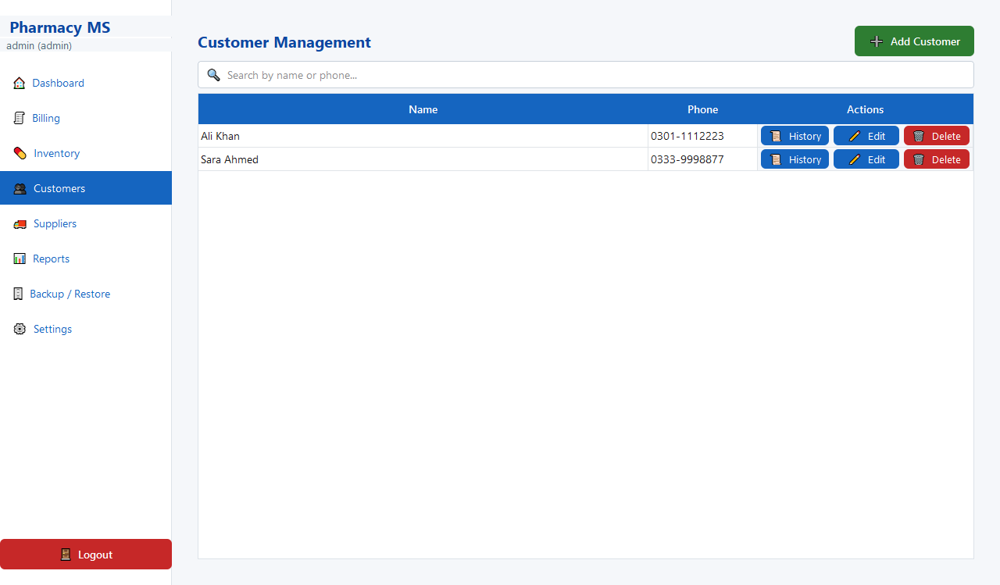
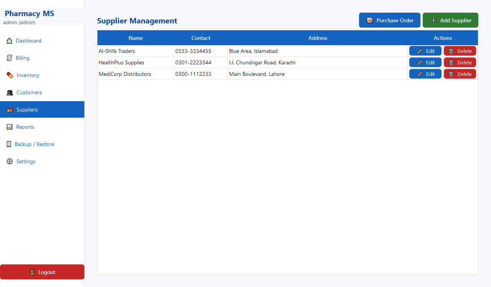
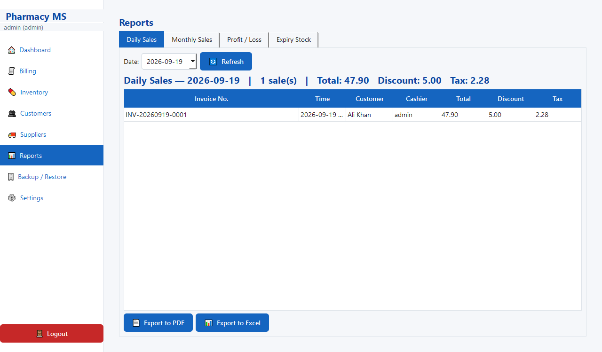
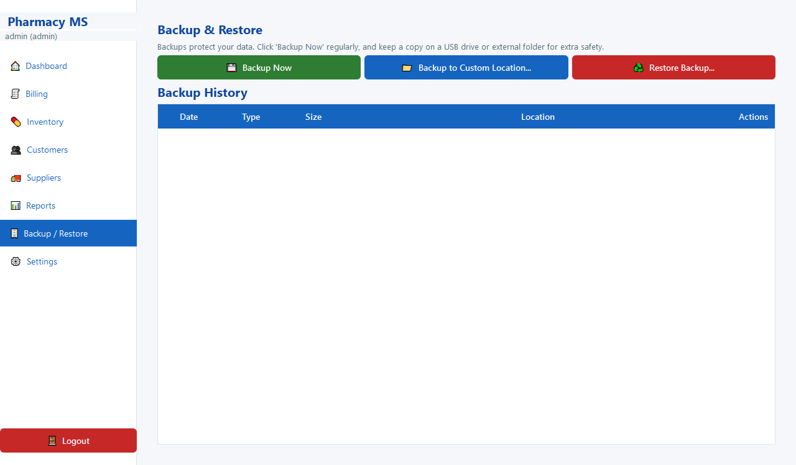
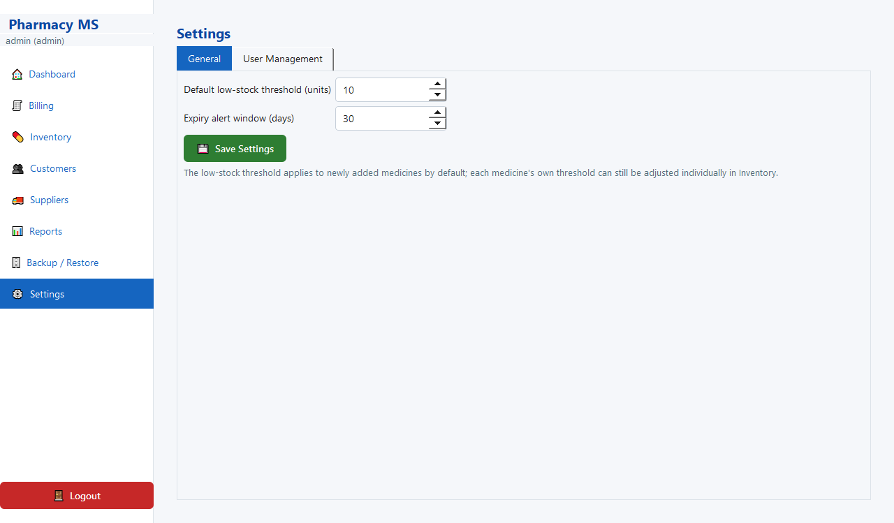
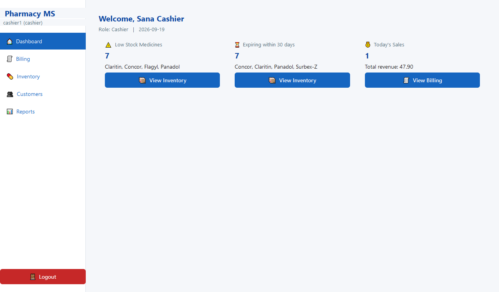

# Pharmacy Management System

A fully offline desktop application for managing a medical pharmacy: inventory,
billing/POS, customers, suppliers, users, reports, and backup/restore.

## Tech stack

- **Python 3** + **PySide6** (Qt6 GUI bindings)
- **SQLite** (local file, auto-created on first run — see "Where data lives" below)
- **reportlab** for PDF invoices/reports, **openpyxl** for Excel exports
- **PyInstaller** for packaging into a single Windows `.exe`

No internet connection is required for any feature.

## Screenshots

| Login | Dashboard |
|---|---|
|  |  |

| Inventory | Billing / POS |
|---|---|
|  |  |

| Customers | Suppliers |
|---|---|
|  |  |

| Reports | Backup & Restore |
|---|---|
|  |  |

| Settings | Cashier role (restricted view) |
|---|---|
|  |  |

## Project structure

```
pharmacy-app/
  main.py                 Entry point
  requirements.txt
  pharmacy_app.spec       PyInstaller build spec
  installer.iss           Inno Setup script (builds the deployable installer)
  database/
    schema.sql            Table definitions
    db_manager.py          Connection handling, schema init, default admin seed
  logic/                   Business logic (one module per feature area)
    security.py            Password hashing (PBKDF2)
    auth.py                 Login + user management
    inventory.py            Medicine CRUD, stock, low-stock/expiry alerts
    suppliers.py             Supplier CRUD + purchase orders (stock intake)
    customers.py             Customer CRUD + sales history
    sales.py                  Cart + checkout (POS)
    invoice_pdf.py             Printable invoice PDF generation
    reports.py                  Daily/monthly/profit-loss/expiry reports
    report_export.py             Excel/PDF export helpers
    backup.py                     Backup/restore/auto-backup/retention
    settings.py                    Configurable thresholds
  ui/                      PyQt/PySide6 forms (one view per feature area)
  data/                    pharmacy.db lives here (auto-created)
  backups/                 Backup files land here by default
  invoices/                Generated invoice PDFs
```

## Running the app (development)

```bash
python -m venv venv
venv\Scripts\activate          # Windows
pip install -r requirements.txt
python main.py
```

On first run, the database and all tables are created automatically, along
with a default administrator account:

- **Username:** `admin`
- **Password:** `admin123`

**Change this password immediately** after first login (Settings → User
Management → Edit → set a new password).

If every admin password is later forgotten, click **"Forgot admin
password?"** on the login screen -- it resets the admin account back to
`admin` / `admin123` (and reactivates it if it was deactivated) with a
confirmation prompt first. Since this is a fully offline app there's no
email/SMS reset path, and without this the shop's data would otherwise be
permanently locked away (Backup/Restore itself is only reachable *after*
logging in as an admin).

Only one copy of the app can run at a time (a shortcut double-clicked twice
by accident shows "Already Running" instead of opening a confusing second
window on the same data).

## Roles

- **Admin**: full access to every module, including Inventory add/edit/delete,
  Suppliers, Backup/Restore, Settings, and User Management.
- **Cashier**: Billing (POS) and read-only Inventory/Customers/Reports. No
  edit/delete rights.

## Payment methods & Udhaar (credit)

Billing supports six payment methods: Cash, Card, EasyPaisa, JazzCash, Bank
Transfer, and **Udhaar (credit)**. A sale doesn't have to be fully paid or
fully credit — the cashier enters an **Amount Paid**, and whatever is left
of the total is automatically added to that customer's udhaar balance
(walk-in customers can't be given credit; a customer must be selected
first). The Customers screen shows each customer's outstanding balance and
has a **Record Payment** button to log partial or full udhaar repayments
(cash, card, or any other method) — the balance and the customer's payment
history update immediately. A customer with an outstanding balance cannot
be deleted until it's settled. Reports → Customer Credit lists every
customer who currently owes money, most-owed first, so following up on
udhaar is a two-click task instead of manual bookkeeping.

## Returns & refunds

The Returns page finds any past sale by invoice number and lets you return
specific line items, in full or partial quantity (e.g. 2 of the 5 strips
sold). Returning an item restocks it back into Inventory automatically. If
that sale was paid partly or fully on udhaar, the refund reduces the
customer's outstanding balance first, and only the remainder (if any) is
handed back as cash — so a return can never accidentally overpay a
customer or under-correct their credit.

## Controlled substances (DRAP compliance)

Medicines that are narcotics/psychotropics can be flagged **🔒 Controlled
Substance** in Inventory → Add/Edit Medicine. Every sale of a flagged
medicine is automatically captured in Reports → Controlled Substances, a
register-style report (date, invoice, medicine, batch, quantity, customer,
prescribing doctor, cashier) matching the documentation format pharmacies
need for DRAP (SRO 808(I)/2001) inspections. The Billing screen also has an
optional **Doctor Name** field for exactly this purpose.

## Thermal printer support

Settings → General lets you choose the receipt format: full-page **A5**
(for a regular printer) or narrow **58mm** / **80mm** (for thermal POS
printers). Checkout prints straight to the shop's default printer — no
manual "open the PDF, then print" step — using Windows' native print verb.

## Audit log

Settings → Audit Log keeps a running record of sensitive actions (large
discounts, udhaar sales, medicine/customer deletions, database restores,
user management changes) with who did it and when — useful for tracing
"who changed this" months later without digging through backups.

## More reports

Beyond daily/monthly sales and profit/loss, Reports now also has: **Dead
Stock** (medicines sitting unsold for 90+ days, so they can be discounted
or returned to the supplier before they expire), **Best Sellers** (top
medicines by quantity sold in a date range), and a 7-day sales trend chart
on the Dashboard.

## Barcode scanning (Billing)

A USB/Bluetooth barcode scanner is just a keyboard emulator — it "types" the
barcode digits into whatever text field has focus and then sends an Enter
key press. The Billing screen's search box is built for exactly this: click
into it once, then scan — each scan looks up the barcode, adds one unit to
the cart (scanning the same item again just increases its quantity), and
clears the box so it's ready for the next scan. Stock is only deducted from
Inventory when the sale is actually checked out, not while items sit in the
cart.

Barcodes are optional per medicine (set in Inventory → Add/Edit Medicine →
Barcode field) — a medicine without one can still be sold by typing its name.

**Generating your own barcodes**: many medicines (loose/repackaged stock,
locally made items) don't come with a manufacturer barcode. In the
Add/Edit Medicine dialog, click **🏷️ Generate** to create a unique internal
code (`PHxxxxxxxx`), then **🖨️ Print Label** to produce a small printable
PDF (name + price + barcode) saved to the `labels/` folder — print it,
stick it on the product, and it scans in Billing exactly like any other
barcode (Code128 encodes plain text, so there's no manufacturer-specific
format requirement).

## Backup & Restore

- **Backup Now** (Dashboard or Backup/Restore page): one click, saves a
  timestamped copy of the database to `backups/` (or a custom folder you pick,
  e.g. a USB drive).
- **Restore Backup**: pick a `.db` file, confirm the warning, and the app
  restarts automatically with the restored data. A safety copy of the
  pre-restore database is kept in `data/` just in case.
- **Backup History**: view and delete past backups from inside the app.
- **Auto-backup**: runs silently once per day on first login, and again
  whenever the app is closed. Only the last 15 auto-backups are kept
  (manual backups are never auto-deleted).

## Packaging into a single .exe

```bash
pip install pyinstaller
pyinstaller pharmacy_app.spec
```

The finished executable is written to `dist/PharmacyManagementSystem.exe`.

**Where data lives when packaged:** the frozen .exe stores its database,
backups, and invoices under `%LOCALAPPDATA%\PharmacyManagementSystem\`
(e.g. `C:\Users\<user>\AppData\Local\PharmacyManagementSystem\data\pharmacy.db`)
— **not** next to the .exe itself. This is deliberate: the installer places
the executable in `C:\Program Files\...`, and a normal (non-admin) running
process cannot write there, so app data must live in a per-user writable
folder regardless of where the .exe is installed. In development (running
via `python main.py`, not frozen), data still lives in the project's own
`data/`/`backups/`/`invoices/` folders for convenience.

Re-run `pyinstaller pharmacy_app.spec` any time after changing the source to
rebuild.

## Building the Windows installer (for deploying to shop PCs)

The raw `.exe` above can be run directly, but for deploying to many
different shop PCs, build a proper installer with **Inno Setup**
(`installer.iss`) — it adds a Start Menu entry (so the app is searchable via
Windows Search), an optional Desktop shortcut, and a proper uninstaller
listed in "Add or Remove Programs":

```bash
winget install --id JRSoftware.InnoSetup -e   # one-time, if not installed
"C:\Users\<you>\AppData\Local\Programs\Inno Setup 6\ISCC.exe" /DInstallerPassword="your-real-password" installer.iss
```

This produces `installer_output\PharmacyManagementSystem_Setup.exe` — copy
just this one file to each shop's PC and run it. It installs to
`C:\Program Files\PharmacyManagementSystem` (a one-time admin/UAC prompt is
normal and expected) and each shop's own data ends up in that PC's own
`%LOCALAPPDATA%\PharmacyManagementSystem\`, completely independent of other
shops' data.

Rebuild both the `.exe` and the installer together after any source change —
the installer script always bundles whatever is currently in `dist/`.

### Install password (anti-piracy gate)

Every `Setup.exe` requires a password before it will install anything --
the wizard's very first page just refuses to continue without it. The same
`Setup.exe` file can be handed out freely; what's actually gated is running
it, so each shop has to get the password from you first.

The password is **never stored in this repo** -- `installer.iss` only has a
placeholder (`CHANGE_ME_AT_BUILD_TIME`) that's overridden via the
`/DInstallerPassword="..."` flag shown above, which you supply locally each
time you build. A build straight from a fresh checkout with no flag
produces an installer nobody (including you) can actually get into, which
is intentional -- it means the placeholder can never accidentally ship.

## Notes / known simplifications

- The `medicines` table (per the required schema) holds one batch/expiry per
  medicine row rather than per-batch lots; receiving new stock via a Purchase
  Order updates the batch/expiry/quantity on that same row.
- Profit/loss reporting uses each medicine's *current* purchase price (the
  schema does not store a historical cost price per sale).
